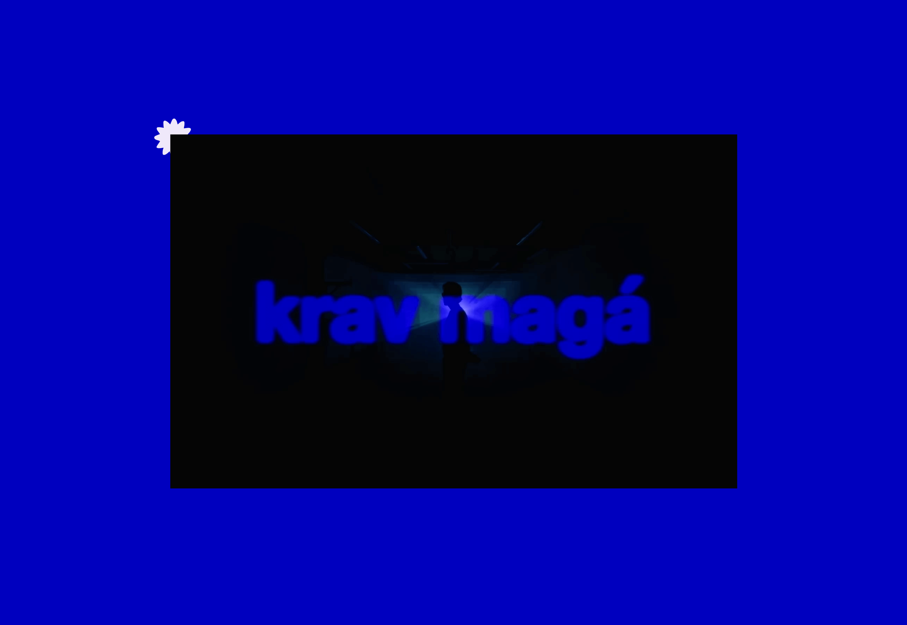
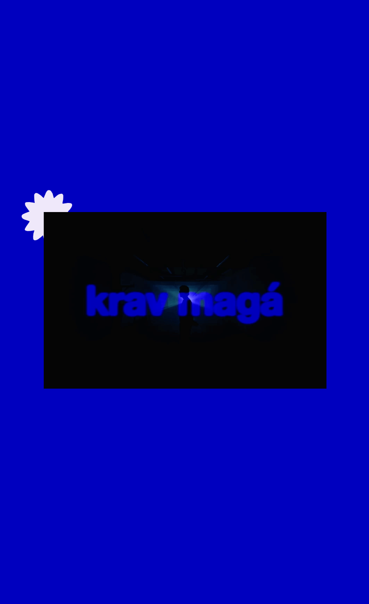

# Reproductor de Video

Este proyecto está basado en el [proyecto de Leonidas Esteban](https://leonidasesteban.com/proyectos/video-player).

Cambié los colores de la interfaz y creé una página para el video llamado "Krav Magá" de NSQK. También agregué un pequeño ícono que es más representativo de la era actual del artista (Donde Estás Flaco?).

## Versión de Escritorio

## Versión Móvil

## Funcionalidades

- 🎵 Interfaz personalizada de reproductor de video
- ⏯️ Funcionalidad de reproducir/pausar
- ⏪⏩ Controles de avanzar/retroceder (10 segundos)
- 📊 Barra de progreso interactiva

[**English Version**](./README.en.md)
